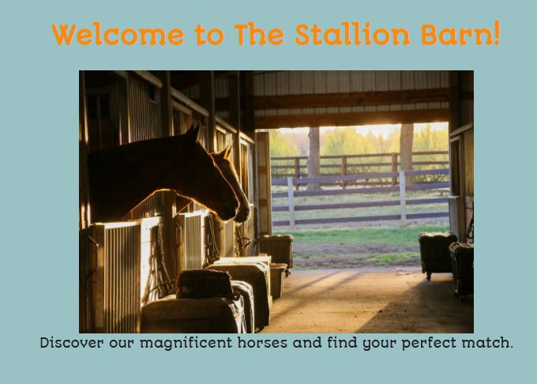

# 🐎 The Stallion Barn

Welcome to **The Stallion Barn**, a centralized management platform designed for horse owners and animal enthusiasts. Whether you're managing a single pony or a full stable, this app helps you stay organized and attentive to your animals' needs.

**The Stallion Barn** allows you to create profiles for yourself and your animals, providing a streamlined way to track daily activities, health updates, and routines based on your personal input.

> **This app was created by a horse lover, for horse lovers.**

---

### 🛠 Technologies Used

* **JavaScript** 
* **EJS** 
* **CSS** 
* **Moment** 
* **CORS** 
* **Helmet**

---

### 🚀 Next Steps & Future Features

I am looking to improve the stable experience. Upcoming updates include:

1.  **Multi-User Support:** Allowing trainers, owners, and stable hands to collaborate within the same barn.
2.  **Automated Reminders:** Integrated notifications for feeding, shoeing, and vet appointments.
3.  **Care Restrictions:** Dedicated modules for dietary requirements, medical alerts, and safety restrictions.

---

### 📜 Attributions

the following resources that made this project possible:

1. Many of Billies EJS lesson code. (as starter code)
2. MongoDB
3. [CSS CheatSheet](https://htmlcheatsheet.com/css/)
4. [express.js](https://expressjs.com/en/resources/middleware/cors.html)
5. [Stack Overflow](https://stackoverflow.com/questions/8360130/how-to-make-a-text-flash-in-html-javascript)
6. [Stakc Overflow](https://stackoverflow.com/questions/2735881/adding-images-to-an-html-document-with-javascript)
7. [Helmet.js](https://helmetjs.github.io/)
